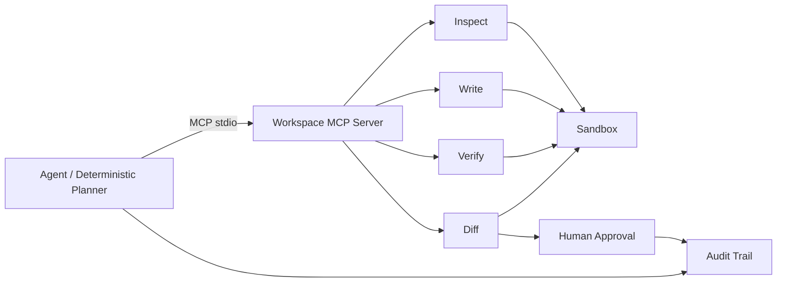

# MCP Verified Agent Loop

**A small, public engineering showcase for MCP, AI-agent tooling, verification gates, and human-in-the-loop review.**

This project demonstrates the workflow I use when working with AI coding agents:

```text
inspect codebase
→ plan
→ implement through bounded tools
→ lint / syntax / tests
→ inspect diff
→ human approval
→ audit trail
```

The important part is not that an agent can write code. The important part is that its **capabilities are bounded and its changes are verifiable**.

## What this demonstrates

- Model Context Protocol (MCP) over stdio
- Tool-connected agent workflow
- Sandboxed repository access
- Path traversal protection
- Protected-path rules
- Bounded file writes
- No generic shell tool
- Allowlisted verification commands
- Test gates before approval
- Git diff inspection
- Human approval
- JSON audit trail
- Cross-platform TypeScript / Node.js implementation
- CI that runs the entire verified demo without API keys

## Architecture



See [docs/architecture.md](docs/architecture.md) for the trust boundaries and design choices.

## MCP tools

| Tool | Purpose | Safety boundary |
| --- | --- | --- |
| `repo_list_files` | Explore repository structure | workspace only |
| `repo_read_file` | Read text files | 100 KB max |
| `repo_search_text` | Search source text | workspace only |
| `repo_write_file` | Apply a bounded change | 50 KB max, protected paths blocked |
| `repo_run_verification` | Run syntax/tests | named allowlist only |
| `repo_diff` | Review resulting change | fixed git diff command |

The server intentionally does **not** expose arbitrary shell execution.

## Run it

Requirements:

- Node.js 22+
- Git

```bash
npm install
npm run verify
```

For an interactive human-approval prompt:

```bash
npm run demo
```

For CI / non-interactive demonstration:

```bash
npm run demo -- --approve
```

## What the demo agent does

The demo starts from a clean fixture repository that already contains a `titleCase` utility.

Task:

> Add a production-friendly `slugify(value)` helper and tests without breaking `titleCase`.

The agent then:

1. lists the repository through MCP;
2. reads the relevant source and package file;
3. searches for an existing `slugify`;
4. produces a change plan;
5. writes source and tests through MCP;
6. runs fixed syntax verification;
7. runs tests;
8. asks the MCP server for the git diff;
9. requires approval;
10. writes an audit record.

The demo workspace is isolated under `.agent-workspace/` and is rebuilt from scratch each run.

## Why no LLM API key is required

This public repo uses a deterministic planner so anyone can reproduce the workflow in CI.

The engineering proof is the boundary: MCP client/server integration, tool design, sandboxing, verification, diff review, approval, and auditability.

A model adapter can replace the planning policy without changing those boundaries.

## Security

Read [SECURITY.md](SECURITY.md).

Highlights:

- no arbitrary filesystem access
- no arbitrary shell command execution
- no environment-file access
- no employer/private code
- explicit human review before acceptance

## Tech

**TypeScript · Node.js 22 · MCP TypeScript SDK · Zod · Vitest · Git**

## Author

**Yuttakan Phunkhlang**  
Software Engineer / Full-Stack Developer  
Nuxt.js · Vue.js · TypeScript · Go · AI Coding Agents · MCP

- LinkedIn: https://www.linkedin.com/in/yuttakan-phunkhlang/
- GitHub: https://github.com/Yuttakarn2545
- Portfolio: https://personal-eosin-omega.vercel.app
