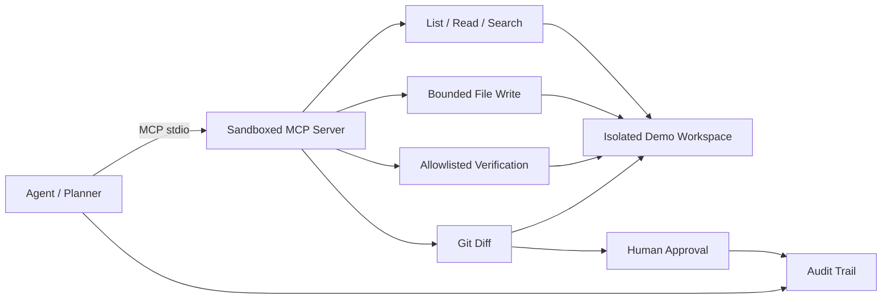

# Architecture



## Why the demo uses a deterministic planner

A reviewer should be able to clone this repository and run the full workflow without an API key or paid model account.

The deterministic planner makes CI reproducible while keeping the important engineering boundary real:

1. the agent communicates with repository tools through MCP;
2. file access is sandboxed;
3. write operations are bounded;
4. verification commands are allowlisted;
5. a diff is produced;
6. human approval is explicit;
7. the run is auditable.

A production LLM adapter can replace the deterministic planning step without changing those tool and verification boundaries.

## Agent loop

```text
inspect
  ↓
plan
  ↓
implement via MCP
  ↓
syntax + tests
  ↓
git diff
  ↓
human approval
  ↓
audit record
```

## Trust boundaries

| Boundary | Enforcement |
| --- | --- |
| Filesystem | root-scoped path resolver |
| Sensitive paths | protected segment denylist |
| Writes | UTF-8 text, size bounded |
| Shell | no arbitrary command tool |
| Verification | fixed command map |
| Review | git diff before approval |
| Traceability | JSON audit events |
